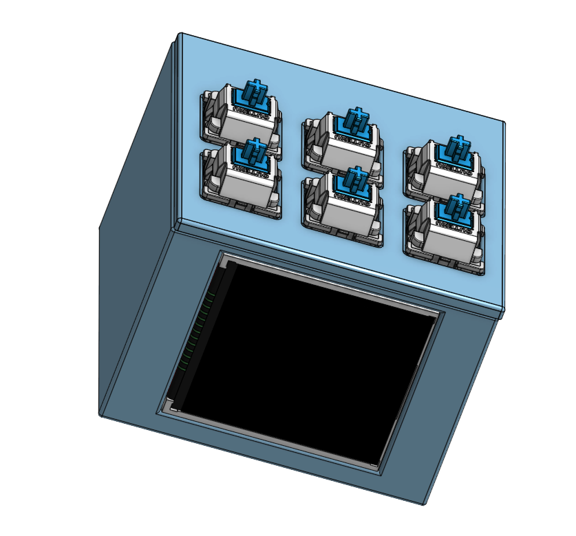
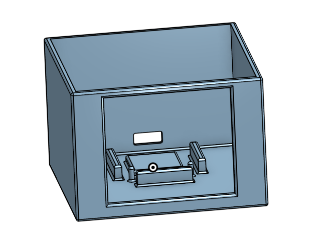
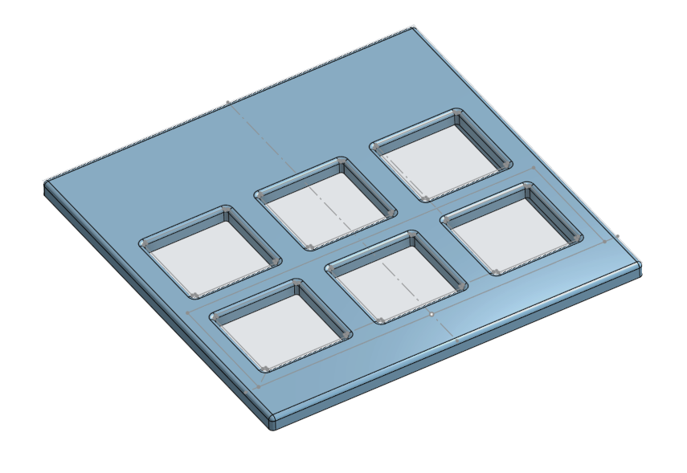

I made a Spotify Display using an ESP-C3 to let me control music from spotify. I can see what is currently playing from the LCD display
and I have 6 keys at the top to actually control my music, timers, clock, etc.

I started this off by following the guide, but now am trying to make it so I can use it as another peripheral in my setup.

Here are some photos of the Full Display:

## Bill of Materials (BOM)

| Name                          | Purpose      | Link                                                                                                                                                                                                                                                                                                                                                                                                                                                                                                                                                                                                     | Price | Quantity |
| :---------------------------- | :----------- | :------------------------------------------------------------------------------------------------------------------------------------------------------------------------------------------------------------------------------------------------------------------------------------------------------------------------------------------------------------------------------------------------------------------------------------------------------------------------------------------------------------------------------------------------------------------------------------------------------- | :---- | :------: |
| MX Silver Linear Key Switches | Key Switches | [Link](https://www.amazon.com/GATERON-Keyboard-Switches-Compatible-Mechanical/dp/B0CGCPW4FV/ref=sr_1_3?crid=3B0DS9NLSTQOL&dib=eyJ2IjoiMSJ9.0B_9YAJrC248k2kl7LxWSEEZpXwIuGY3uETx0jTHY8RVdXJH3ylvYOOGFDx-qFApgnDN_P3ceVljtMe8nhl69P1cxnFNowIhO8wHz9FaHHqkkTbmWhGJ4j7po2OZMl8ogLdxLvbS-zJp-bQE6MdHNE1MY_ahYoBJaXZxvfPfIiZJBFKWM1837Qo5loW1Nt3xNqNw9dGdg5Nr6Gl-G3BzEjLIA2aDJVVE_FyY4H-uV2I.6Ftc2Ki7ryH2jADKvFAphmFPT4mpvo-23isumYhaXL4&dib_tag=se&keywords=mx%2Bsilver%2Blinear%2Bkey%2Bswitches%2B3%2Bcount&qid=1776385738&sprefix=mx%2Bsilver%2Blinear%2Bkey%2Bswitches%2B3%2Bcou%2Caps%2C166&sr=8-3&th=1) | $9.99 |    1     |
| ST7735                        | LCD Display  | [Link](https://www.amazon.com/HiLetgo-ST7735R-128160-Display-Arduino/dp/B00LSG51MM/ref=sr_1_2?dib=eyJ2IjoiMSJ9.tx-rvj4pd6_2ng1YR-IHEarwXAwEP09-xe7mzD0gLVLK6Gvqo5lN5uDzYWm2X3y8DTLPtwOZpOAGeQb9EBzXxyPzxE3Ns7W9LDShjTXILD-2N9cSgH7YqpjGWaVIRnWAQvECqYBM45S0uLojngGEKlyi7erIThp3kh8To0P0UGfMJ8Wm7J3lqw4PMayhbFCGJEpNh2vEEqMzmUjyJPFISluu5mM81qL6sWJTcllcsv4.eMTRo4hKf1oUimUNUzdJHPoDJf3xETQ9pv944k4PxQU&dib_tag=se&keywords=LCD_TFT_1.8_SPI_ST7735&qid=1776386128&sr=8-2)                                                                                                                                 | $9.69 |    1     |
| LOLIN C3 mini                 | ESP C3       | [Link](https://www.aliexpress.us/item/3256804553736450.html?gatewayAdapt=glo2usa4itemAdapt)                                                                                                                                                                                                                                                                                                                                                                                                                                                                                                              | $0.99 |    1     |
